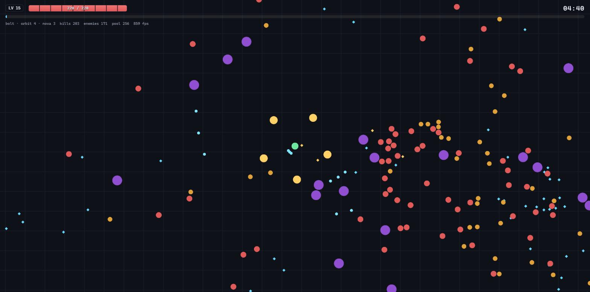

# Survivor

Roguelite в жанре survivor-like (Vampire Survivors, Brotato, Halls of Torment) на TypeScript и PixiJS.
Оружие стреляет само — игрок решает только, где стоять.

**▶ [Играть](https://igogot.github.io/survivor-game/)**



_Четвёртая минута: болт бьёт очередями по трое, орбита режет вплотную, кристаллы
стягиваются к игроку. Отладочная строка сверху — счётчик пула и текущий fps._

---

## Управление

| Клавиша | Действие |
|---|---|
| `WASD` / стрелки | движение |
| `1` `2` `3` `4` | выбор апгрейда при повышении уровня |
| `Esc` / `P` | пауза и снятие паузы |
| `R` | перезапуск: на паузе и после смерти |

С телефона играется тем же самым: палец на экране — движение, касание карточки —
выбор апгрейда, кнопки в меню паузы и на экране итогов делают то же, что `Esc` и
`R`. Кнопка вызова паузы появляется сама, когда клавиатуры нет.

Правила, управление и механики собраны в одну панель, которая открывается перед
первым забегом, на паузе и на экране итогов. Числа в ней не набраны руками, а
прочитаны из тех же констант, что использует симуляция, — подробнее в разделе
«Панель правил».

`?seed=12345` в адресной строке повторяет конкретный забег — вся симуляция детерминирована.

---

## Оружие

Всё стреляет само. Забег начинается с одного оружия, остальные выпадают в меню
уровня и там же прокачиваются.

Помимо общих статов у каждого оружия есть свои улучшения — они предлагаются
только когда оружие уже на руках. Общий стат множит всё оружие сразу, улучшение
оружия — ровно одно; без этого вкладываться в конкретное оружие было бы нечем,
кроме повторного взятия, а оно упирается в потолок стаков.

| Оружие | Как работает | Против чего |
|---|---|---|
| **Auto Bolt** | автонаведение на ближайшего врага, веер снарядов | одиночные цели, дальняя дистанция |
| **Orbit Blades** | кольцо клинков на расстоянии вытянутой руки, режет импульсами | телохранитель: всё, что дотянулось до игрока |
| **Shockwave** | периодический взрыв урона по площади вокруг игрока | толпа |

Orbit Blades не создаёт ни одной сущности: кольцо — это функция одного угла,
поэтому оружие бесплатно по памяти независимо от числа лезвий. Shockwave — один
запрос к сетке на импульс.

---

## Враги

Типы открываются по времени и дальше идут вперемешку, с весами.

| Враг | С какой минуты | Чем неприятен |
|---|---|---|
| **Grunt** | с начала | ничем в отдельности, но их всегда больше всех |
| **Runner** | 1:30 | быстрый: от него не убежать, только развернуться |
| **Brute** | 3:00 | медленный, толстый и бьёт больнее всех |
| **Splitter** | 7:00 | при смерти разваливается на двух отпрысков прямо под ногами |
| **Boss** | 10:00, дальше циклом | дуэль, а после минуты тишины — дуэль внутри толпы |

Splitter — единственный, чья смерть что-то меняет: остальных четверых убийство
просто убирает с поля. Отпрыски появляются в точке гибели, а не на кольце за
экраном, поэтому обычный приём «убежал — оторвался» на нём не работает.

---

## Что здесь интересного с инженерной стороны

Жанр выбран не ради жанра: на экране одновременно живут сотни врагов, и наивная
реализация умирает на пятидесяти. Основная работа в проекте — не геймплей, а то,
что позволяет ему держать 60 fps.

### Фиксированный шаг симуляции с интерполяцией рендера

`src/core/loop.ts` — собственный игровой цикл с аккумулятором. Симуляция всегда
идёт ровными шагами по 1/60 секунды, поэтому баланс и физика ведут себя
одинаково на мониторе 60 Гц и 144 Гц. Остаток аккумулятора передаётся в рендер
как `alpha`, и спрайты отрисовываются между предыдущей и текущей позицией —
движение остаётся плавным даже при частоте кадров выше частоты тиков.

Отдельно обработан «спираль смерти»: длинный кадр (вкладка ушла в фон, сработал
брейкпоинт) обрезается по `maxFrameTime`, иначе очередь догоняющих тиков
подвесит следующий кадр ещё сильнее.

### Пространственный хеш вместо перебора

`src/world/grid.ts`. Проверять каждый снаряд против каждого врага — это O(n·m) и
десятки тысяч проверок дистанции за тик. Равномерная сетка раскладывает врагов по
ячейкам, и запрос обходит только те ячейки, которые пересекает круг запроса.

Сетка намеренно консервативна: она может вернуть лишних кандидатов, но не имеет
права пропустить пересекающегося. Ровно это и проверяет `tests/grid.test.ts` —
3000 точек, 200 случайных запросов, сверка с полным перебором.

### Пул объектов

`src/core/pool.ts`. Десятиминутный забег порождает десятки тысяч врагов, снарядов
и кристаллов. Аллокация каждого заново отдаёт сборщику мусора поток
короткоживущих объектов, что видно как периодические просадки кадра. Пул
переиспользует их, и число аллокаций выходит на плато после первой минуты —
счётчик `pool` в отладочной строке HUD показывает это в реальном времени.

Инвариант «каждый объект либо жив в мире, либо лежит в свободном списке»
проверяется тестом — он ловит и двойной release, и утечку.

### Логика не знает про рендер

`src/world/` и `src/systems/` не импортируют ни Pixi, ни DOM. Единственный файл,
который знает о движке, — `src/render/renderer.ts`, и он только читает состояние.

Практическое следствие: забег целиком проигрывается в Node без браузера
(`tests/simulation.test.ts`), а детерминированный ГПСЧ делает баг
воспроизводимым по номеру сида, а не «у меня иногда падает».

### Оружие как данные

`src/data/weapons.ts` — размеченное объединение по полю `kind`, `src/systems/weapons.ts`
разбирает его исчерпывающим `switch`. Добавить четвёртый тип оружия нельзя молча:
компилятор укажет на ветку, которую забыли написать. Уровень оружия — тоже
данные (`damagePerLevel`, `orbsPerLevel`), а формулы масштабирования лежат рядом
с определениями, потому что рендер обязан считать позиции лезвий ровно теми же
функциями, что и урон, — иначе лезвие бьёт не там, где нарисовано.

Эти формулы принимают состояние оружия, а не его уровень. Разница не
косметическая: модификаторы лежат в состоянии, и передача уровня позволила бы
применить модификатор в системе и забыть в рендере — ровно тот случай, от
которого страхует абзац выше. С состоянием на аргументе компилятор сам находит
всех вызывающих.

Отдельная деталь — дедупликация урона по площади. Кольцо из четырёх лезвий
делает четыре запроса к сетке, и враг между двумя лезвиями попадает в оба.
Вместо `Set` на импульс на враге лежит целочисленная метка последнего
задевшего его события (`Enemy.hitTag`): счётчик событий только растёт, поэтому
переиспользованный из пула враг не может нести метку из будущего и очищать её
между импульсами не нужно.

### Враг, чья смерть что-то делает

`reapSystem` уже был местом, где обрабатывается гибель, поэтому механика
делящегося уместилась в одну функцию. Интересным оказалось не это, а то, как
пришлось её настраивать.

Дети добавляются в массив, по которому прямо сейчас идёт цикл удаления. Это
безопасно ровно из-за направления цикла: он идёт **вниз**, дети дописываются в
конец, а один из них swap-remove'ом попадает в освободившийся слот — который
счётчик уже прошёл. Так новорождённый не проверяется на «отошёл слишком далеко»
в тот же тик, когда появился. Цикл вверх сломал бы это, и в комментарии над
функцией написано именно это условие, а не «тут всё хорошо».

Настройка же вышла поучительной. Первая версия уронила средний забег с 544s до
406s, и стенд упал на собственной страховке: до босса не дошёл почти никто. Три
гипотезы подряд оказались неверными, и каждую убил замер:

| Что меняли | Средний забег |
|---|---|
| без делящегося | **544s** |
| вес 4 | 406s |
| вес 2 | 437s |
| отпрыски медленнее грунта | 422s |
| отпрыски хрупкие (4 hp) | 400s |
| деление оплачивается бюджетом спавнера | 412s |
| урон 10 → 6 | 413s |
| **открывается на 7:00 вместо 4:00** | **512s** |

Ни вес, ни скорость, ни живучесть, ни урон не сдвинули результат — все пять
конфигураций легли в 400–440s. Дело было не в характеристиках врага, а в том,
**когда** он появляется: на четвёртой минуте он попадал в окно, где решается,
разгонится забег или нет, и рубил именно те забеги, которые иначе дожили бы до
босса. Перенос открытия на седьмую минуту вернул почти всё.

Доказательство лежит в самой таблице: сиды 99, 11 и 2024 гибнут до седьмой
минуты, делящегося не видят — и их забеги совпадают с базовыми посекундно.

Отдельная находка, которую стоит помнить при добавлении любого врага. Урон от
касания берёт **только самый сильный удар в радиусе**, а неуязвимость длится
0.5 с. Значит потолок урона орды задан одним самым больно бьющим типом и не
зависит от её размера: шестьсот врагов бьют ровно так же, как один брут. Замер
это подтвердил буквально — смена урона делящегося с 10 на 6 не изменила ни один
из восьми забегов ни на секунду.

Деление при этом оплачивается из бюджета спавнера (`bodyCost`): лишние тела
отодвигают следующую волну. На средний забег это не повлияло, но без этого
`pressurePerMinute` перестал бы описывать реальное давление — а вся настройка
сложности в этом проекте держится на том, что одна строка конфига честно
описывает то, что происходит на экране.

### Забег без конца

Закончить забег можно только смертью. Босс приходит на десятой минуте, и раньше
на этом всё и кончалось: `reapSystem` ставил фазу `'won'`, показывался экран
«Survived». Теперь смерть босса — отметка, а не финал. `defeatBoss` увеличивает
счётчик, снимает флаг и назначает следующее прибытие, а орда возвращается — и
возвращается она хуже, чем ушла, потому что кривая сложности всё это время не
останавливалась.

Пока босс на поле, спавнер выключен — это и есть «дуэль». Первая версия цикла
унаследовала это правило от одноразового босса, и стенд показал, во что оно
превращается на втором и третьем. Замер длительности каждой дуэли и HP игрока на
входе и выходе:

```
seed  boss   дуэль   hp вход  hp выход
1337     1    407s        38        38
7        2     70s       104       179
5        2   1162s       131       131   (не добит за 40 минут)
```

Игрок не терял **ни одного HP**. Босс медленнее его (46 против 175 и выше),
догнать не может, а орда в это время не приходит — значит, чем жирнее босс, тем
длиннее безопасная пауза. Сид 5 провёл девятнадцать минут из сорока с фактически
выключенной игрой, а `hpScalePerBoss` работал ровно наоборот: делал забег легче.

Поэтому тишина ограничена сверху. `CONFIG.boss.duelGrace` — минута, после
которой орда возвращается независимо от того, жив босс или нет. Минута взята из
замера первых дуэлей (37s, 73s, 89s): кто укладывается, получает чистый
поединок; кто нет — доигрывает его в толпе. Сид 1337 после этого гибнет прямо в
первой дуэли на 674-й секунде, а самая длинная дуэль во всём стенде — 140s
вместо 1162s. Побочный эффект оказался приятным: дуэли короче ещё и потому, что
кайтить больше нельзя — игрок остаётся рядом, и по боссу начинают работать
орбита и волна, а не один болт.

Время следующего босса живёт как дедлайн `world.nextBossAt`, а не считается
остатком от деления. Дуэль занимает до двух с половиной минут, и по остатку от
деления ровно на это время укорачивалась бы передышка после тяжёлого боя —
то есть тем сильнее, чем тяжелее он дался. Отсчёт от момента смерти даёт
одинаковый перерыв в любом случае.

HP босса растёт по числу убитых, а не по времени. Общая кривая орды к сорок
шестой минуте даёт 24-кратный множитель, и вторая дуэль с таким числом — не бой,
а стена. Счёт по боссам привязывает сложность к тому, что игрок действительно
сделал: +80% за каждого предыдущего. Осмысленным это число стало только после
ограничения тишины — до него оно двигало сложность не в ту сторону.

Убрать победу оказалось дешевле, чем добавить. `Phase` — union, поэтому удаление
`'won'` заставило компилятор показать каждое место, которое про неё знало: два в
`main.ts`, экран итогов, бот, стенд баланса и тест паузы. Тот же приём, которым
добавлялась `'paused'` (см. `src/world/pause.ts`), только в обратную сторону.

### Поздняя игра, которую никто не мерил

`npm run balance` смотрит окно в двенадцать минут. Это была вся игра, пока её
заканчивал босс, и перестало ею быть, когда босс стал отметкой. За тем, что
происходит дальше, не следил никто — и вот что там оказалось, когда появился
`npm run endless` (сорок минут, те же восемь сидов):

```
seed      time   outcome  bosses   level     kills   hits  hits/min  minHP
42       2399s    alive       3      90    108958      7       0.0    137
1337      322s     died       0      11      1195      8         -      -
99        396s     died       0      10       868     15         -      -
7        2399s    alive       3      90    107693      0       0.0    225
11        682s     died       0      15      1671     10         -      -
2024      457s     died       0      13      1964     10         -      -
5        2399s    alive       3      78     89052      1       0.0     86
808      2399s    alive       3      89    108133      4       0.0    169
```

Колонка `hits` — сколько раз по игроку попали за **весь** забег. Ноль, один,
четыре, семь. Сид 7 провёл сорок минут при шестистах врагах на поле и не получил
ни одного удара.

Три рычага были написаны и измерены, и ни один не помог:

| Что пробовали | попаданий/мин после 20-й | уровень на 40-й | убийств |
|---|---|---|---|
| как есть | 0.0 | 78–90 | 89–109k |
| орда ускоряется до ×2.6 | 0.0–0.2 | 100–104 | 154–174k |
| и потолок врагов растёт до 1350 | 0.0–0.1 | 115–120 | 231–254k |

Обе правки сделали игрока **сильнее**: уровень вырос с 90 до 120, убийства со ста
тысяч до двухсот пятидесяти. Давление орды здесь не угроза, а ресурс — каждый
добавленный враг доходит, гибнет и становится опытом.

Причина, по которой ни один рычаг не достаёт, складывается из трёх фактов. Игрок
бежит 275 против 96 у самого быстрого врага, и погоня на плоскости — порог, а не
градиент: пока враг медленнее, разрыв растёт и попаданий ноль. Границ у арены
нет, бежать можно вечно. А урон от касания берёт только самый сильный удар в
радиусе при неуязвимости 0.5 с, то есть потолок 28 в секунду не зависит от того,
шестьсот там врагов или полторы тысячи.

Вывод, ради которого стенд и написан: HP, скорость и плотность физически не
дотягиваются до игрока, который держит дистанцию. Рычаги были откачены, а стенд
остался — именно он теперь стоит между поздней игрой и следующим таким дрейфом.

### Баланс измеряется, а не угадывается

`tests/bot.ts` — детерминированный бот, который умеет единственный навык, реально
нужный в этом жанре: кайтить. Рулёжка сделана как потенциальное поле — каждый
ближний враг отталкивает, ближайший кристалл притягивает, а смешиваются они по
тому, насколько сильно на бота давят. Апгрейды он берёт по фиксированному
списку приоритетов, поэтому два забега на одном сиде — это один и тот же забег.

Это не украшение, а инструмент. Первая же прогонка опровергла мою собственную
гипотезу: я считал, что от толпы невозможно увернуться и надо чинить контактный
урон, а кайтящий бот спокойно проходил 3 забега из 4 целиком — сломан был не
урон, а предыдущий бот, ходивший по кругу внутрь толпы. Кривые спавна после
этого настраивались по таблице `npm run balance`, а не на глаз.

Текущее состояние — восемь забегов на фиксированных сидах. Забег больше не
кончается сам, поэтому стенд смотрит окно в двенадцать минут: этого хватает на
первого босса и пару минут после него. `alive` — бот был жив на момент звонка.

```
seed      time   outcome   kills   level   bosses
42        720s    alive   10440      29        1
1337      322s     died    1195      11        0
99        396s     died     868      10        0
7         720s    alive    9103      29        1
11        682s     died    1671      15        0
2024      457s     died    1964      13        0
5         720s    alive    7945      24        1
808       720s    alive    8895      24        1

дошли до босса: 5/8   свалили хотя бы одного: 4/8   средний забег: 592s
```

Эта таблица однажды успела устареть прямо в README: она была снята до починки
кольца лезвий, а после неё стала 592s вместо 512s и 4 сваленных босса вместо
двух. Записано отдельно, потому что мораль тут не про лезвия — стенд полезен
ровно настолько, насколько его перегоняют после чужих правок, а не только после
своих.

Колонка `outcome` заодно перестала врать. Раньше исходом считалась победа, а всё
остальное печаталось как `died` — включая забег, который просто упёрся в предел
окна. В прошлой версии этой таблицы так был помечен сид 1337: он дожил до конца
окна, а в README числился мёртвым.

Разборы ниже сделаны, когда забег ещё заканчивался победой над боссом, и счёт
в них — победы. Метрика с тех пор сменилась на «свалил хотя бы одного», но сами
выводы держатся на сравнении двух прогонов, а не на названии колонки.

Самое полезное, что показал стенд, — это A/B по одному числу. Если убрать
смещение спавна по курсу игрока, бот живёт **дольше** (640 s против 504 s), но
выигрывает **реже** (1 из 6 против 3 из 6): он убегает от всего подряд, мало
убивает, приходит к боссу на 8–11 уровне вместо 14–21 и не может его продавить.
Убегание было локально выгодной и глобально проигрышной стратегией, и увидеть
это на глаз было невозможно.

Смягчение роста HP врагов (0.5 → 0.42 за минуту) стенд отверг: 2 победы из 8
вместо 3. Число вернули.

Ещё раз стенд оправдал себя, когда у каждого оружия появилась своя ветка
прокачки. Изменение выглядело чисто структурным — карточки, которые не могут
ничего сделать, перестали выпадать, — но пул вырос с девяти позиций до
тринадцати, а значит каждая отдельная стала выпадать реже. В том числе те, на
которых забег и держится: уровни самого оружия. Бот перестал заканчивать забеги
совсем — 0 побед из 8 при 402s среднего, то есть `npm run balance` падал на
собственной страховке «забег, который бот никогда не заканчивает, — это не
игра».

Чинилось это двумя числами, и оба измерены, а не угаданы. Четвёртая карточка на
уровне возвращает шансы примерно к тем, что давали три из девяти: 2 победы из 8
против 3 — она стоит ровно одной победы. Второе — рулёжка самого стенда: бот
держал оружейные апгрейды в конце списка приоритетов, потому что раньше у
орбиты и волны была только одна ветка, «шире». Он их почти не брал, но в
раскладе они всё равно занимали место, и стенд мерил игрока, который платит за
выбор и не пользуется им. Ветка на темп у каждого оружия и приоритет, при
котором бот их действительно берёт, возвращают таблицу к трём победам и
поднимают средний забег до 530s.

Тот же стенд нашёл потолок, которого в десятиминутном забеге не видно. Если
отключить босса и дать боту выживать, сколько выйдет, один сид из пяти доживает
до 46-й минуты и 74-го уровня. Тринадцать апгрейдов дают в сумме пятьдесят
стаков — то есть на 51-м уровне покупать становится нечего, и двадцать три
уровня подряд не дают ничего: `progressionSystem` молча съедал их, потому что
показывать пустое меню хуже. Отсюда «хвост» в конце `src/data/upgrades.ts` —
шесть позиций без предела стаков, слабее своих обычных аналогов (Whetstone даёт
+25% урона пять раз, Grindstone — +10% сколько угодно).

Важнее самих карточек то, когда они выпадают: никогда, пока обычный пул может
набрать меню. Иначе повторилась бы история абзацем выше — пул вырос бы с
тринадцати позиций до девятнадцати и разбавил ровно те карточки, на которых
держится билд. Хвост шаффлится отдельно и только когда обычных карточек не
хватило на четыре слота, так что до 47-й покупки забег тратит ровно те же числа
из PRNG, что и раньше. Проверяется это не на слово: таблица выше после
изменения совпала посимвольно, а `tests/progression.test.ts` считает расход
генератора напрямую.

### Кольцо, которое било мимо

Orbit Blades ощущались слабыми, и стенд объяснил почему: дело было не в числах
урона, а в двух геометрических дефектах.

Первый — дырка в середине. Кольцо резало в тонком поясе 45–87 px, а враг
касается игрока на 22 px, так что тот, кто уже грыз игрока, не задевался вообще.
И каждое вложение эту дырку расширяло: уровень отодвигал кольцо на +7 px, а
`Long Reach` множил радиус кольца наравне с радиусом клинка. Полностью
прокачанные клинки не наносили урона нигде ближе 95 px от того, кого охраняли, —
апгрейд уносил зону поражения от врагов, ради которых оружие и берут.

Второй — решето. Урон снимается мгновенным отпечатком в момент импульса, а не
мазком по пройденной дуге. Кольцо проворачивалось между укусами на 0.96 радиана,
а клинок закрывал 0.64: треть окружности не проверялась никогда, и враги
проходили сквозь щель между двумя отпечатками нетронутыми. `Whirling Edge` эту
щель расширял, покупая +50% вращения против +40% темпа.

Оба дефекта теперь заперты тестами, а не просто исправлены: враг вплотную обязан
получать урон на любом уровне, а дуга, пройденная за импульс, обязана быть
меньше ширины клинка при любом стаке. Оба теста падают на прежних числах.

Мерилось бюджетом карт — сколько живёт бот, если ему разрешено потратить на
клинки ровно N карточек, а дальше только общие статы.

| карт в клинки | было | стало |
|---|---|---|
| 0 | 421 s | 421 s |
| 1 | 393 s (−7%) | 525 s (+25%) |
| 2 | 468 s (+11%) | 528 s (+25%) |
| 3 | 440 s (+5%) | 593 s (+41%) |
| все | 406 s (−4%) | 604 s (+43%) |

Слева кривая шумит вокруг нуля и заканчивается в минусе: оружие, в которое
вложились полностью, делало забег хуже, чем если бы карточку не брали ни разу.
Справа она монотонная.

Восьми сидов, на которых стоит `npm run balance`, для этого замера не хватило: на
них две карты в клинки давали «+31%», и это был чистый шум — на двадцати сидах то
же самое схлопнулось до +11%. Разброс забегов здесь больше измеряемого эффекта,
и цена ошибки — отчёт о победе там, где ничего не изменилось.

Килы при этом падают с ростом вложения (1612 → 1035), и это не дефект, а роль:
клинки покупают время, а не убийства. Толпу по-прежнему чистит Shockwave, и
выбор между ними стал выбором между «убивать» и «не умирать», а не между сильной
карточкой и слабой.

### Одна текстура на всю сцену

`src/render/textures.ts` собирает один холст и скармливает его
spritesheet-загрузчику Pixi. Источник у всех кадров один, поэтому сцена батчится
в пару вызовов отрисовки независимо от того, сколько на экране врагов и какие
они разные. Отдельные PNG на сущность сломали бы ровно это свойство.

Пиксели берутся из тайлов Kenney «Tiny Dungeon» (`src/render/artwork.ts`), а
`src/render/atlas.ts` держит нарисованные фигуры на случай, если лист не
загрузится. Запасной путь работает покадрово, а не «всё или ничего»: у ударной
волны в подземельном тайлсете эквивалента нет, поэтому кольцо остаётся
нарисованным даже когда всё вокруг пришло с листа.

Тайлы Kenney нарисованы под пол подземелья и лежат на непрозрачной тёмной
карточке — у босса она занимает 57% тайла. Оставить её значило бы, что каждая
сущность таскает за собой тёмный квадрат, а толпа читается как сетка, поэтому
при сборке атласа этот цвет выбивается в прозрачность. Внутри самих спрайтов он
не встречается, что и делает операцию безопасной.

### Чем заменили тинт

Пока кадры были белыми масками, тинт делал две работы сразу: различал типы
врагов и давал вспышку урона. Полноцветный арт отнял обе, и по-разному.

Различение типов исчезло само: у `grunt`, `runner`, `brute` и `boss` уже были
отдельные кадры, и настоящая графика на тип делает цветовое кодирование
ненужным.

Со вспышкой хуже. Тинт умножает, поэтому по белой маске белый тинт давал
максимальную яркость, а по цветному спрайту не меняет ровно ничего — вспышка
пропала бы молча. Теперь это отдельный проход: копия того же кадра поверх врага
в аддитивном режиме, с прозрачностью по остатку вспышки. Осветляет вместо того,
чтобы перекрашивать, поэтому одинаково работает и для маски, и для нарисованного
краба. Текстура та же самая, так что весь слой — это по-прежнему один вызов
отрисовки, сколько бы врагов ни получало по морде одновременно.

Кристаллы после этого различаются кадром, а не оттенком: цвет — первое, что
теряется в толпе, и теряется совсем, когда спрайты приносят свой собственный.

Фон в атлас не входит: `TilingSprite` повторяет всю исходную текстуру целиком,
и кадр из общего листа затащил бы в каждую плитку своих соседей.

Упаковка — чистая функция, и её проверяет `tests/atlas.test.ts`: наложение
кадров дало бы спрайт с уголком соседа, что выглядит как ошибка рисования, а не
как ошибка упаковки, и искалось бы долго.

### Палец вместо клавиатуры

Игра выложена ссылкой, а ссылку открывают с телефона — где нет ни `WASD`, ни
`Esc`, ни `R`. Так что касание здесь не «ещё одна раскладка»: без него по ссылке
не во что играть.

Стик плавающий — он появляется там, где палец коснулся стекла, и меряет смещение
от этой точки. Стик, нарисованный в углу, пришлось бы искать глазами, то есть
отвести взгляд от толпы, а это единственное, чего жанр не прощает; к тому же на
телефоне палец уже лежит поверх того самого угла.

Геометрия стика (`src/core/touch.ts`) не знает про DOM ровно по той же причине,
по которой про него не знает симуляция: мёртвая зона, клэмп и направление — это
арифметика, и проверять её честнее в Node, чем пальцем по стеклу
(`tests/touch.test.ts`). Клавиатура и палец складываются и клэмпятся до единицы:
ни одна половина не знает про другую, а зажать обе и поехать в полтора раза
быстрее нельзя — симуляция умножает этот вектор прямо на `moveSpeed` и приняла
бы любую длину.

Смещение при этом аналоговое, и это не украшение. Клавиатура умеет только полный
ход в одну из восьми сторон, а большой палец, которому надо дожать до края,
чтобы сдвинуться вообще, не может делать мелкие поправки — те самые, из которых
игра и состоит.

### Чего ещё стоит телефон

- **Разрешение рендера прибито к 2.** Телефон с `devicePixelRatio` 3 просит в
  девять раз больше фрагментов, чем экран 1x, а сцена упирается именно в
  заполнение: полная орда — это сотни полупрозрачных спрайтов друг на друге.
  Выше двух разница не видна на вытянутой руке, а стоит кадра.
- **Жесты браузера выключены.** Протяжка для него — скролл, двойное касание —
  зум, долгое нажатие — выделение текста. Всё это на самом деле игрок, который
  пытается идти.
- **`viewport-fit=cover` и `env(safe-area-inset-*)`** — HUD не уезжает под чёлку
  и под полоску жеста.
- **Узкий экран перекладывает интерфейс:** карточки уровня становятся сеткой
  2×2, отладочные счётчики прячутся — они для разработчика за столом и стоят
  строки на экране, которой там и так нет.
- **Одна кнопка, которой нет на десктопе** — та, что открывает паузу: без `Esc`
  меню иначе не вызвать. Она появляется только при `pointer: coarse`, так что
  клавиатурные экраны остались ровно такими, какими были. Кнопки внутри самих
  панелей — общие для всех устройств.

### Панель правил

Игра не объясняет себя, пока идёт: оружие стреляет само, меню апгрейда всплывает
без предупреждения, босс приходит на десятой минуте. Всё это можно узнать только
проиграв — поэтому есть панель, которую показывают в трёх местах: перед первым
забегом, на каждой паузе и поверх экрана итогов.

Занятного в ней две вещи.

**Числа не набраны, а прочитаны.** «10:00», «4 карты», «75 пикселей», «0.5
секунды», здоровье и урон босса — всё берётся из `CONFIG`, `BOSS` и
`OFFERS_PER_LEVEL`. Справка, в которой числа записаны руками, устаревает молча:
кривая спавна меняется, а уверенная фраза остаётся. Ради этого `OFFERS_PER_LEVEL`
пришлось экспортировать — подсказка «жми 1 2 3» над четырьмя карточками хуже, чем
её отсутствие.

**Содержимое отделено от вёрстки.** `src/ui/help.ts` отдаёт секции как данные, и
только потом отдельный проход собирает из них узлы. Это и позволяет
`tests/help.test.ts` проверять, что́ панель говорит, без единого элемента DOM:
что описано всё оружие из `WEAPONS`, что клавиш ровно столько же, сколько
карточек, что у каждой строки управления есть что нажать. Оружие, добавленное без
строчки описания, роняет тест, а не показывает игроку пустое место под названием.

Строки разделены на клавиатурные и пальцевые тем же `pointer: coarse`, что и
кнопка паузы: на телефоне нет `Esc`, на десктопе нет большого пальца, и панель,
показывающая обе раскладки сразу, врёт половине читателей.

Перед первым забегом мир по-настоящему стоит на паузе, а не просто закрыт
панелью: брифинг, за чтение которого снимают здоровье, читают один раз. При
перезапуске он не возвращается — тот, кто нажал «ещё раз», уже всё прочитал.

### Порядок систем внутри тика

Неочевидная, но принципиальная часть — `src/world/step.ts`. Сетка хранит
*индексы* в массиве врагов, поэтому любое удаление их инвалидирует. Отсюда
жёсткий порядок: сначала убрать мёртвых с прошлого тика, потом заспавнить новых,
потом подвинуть всех, и только потом строить сетку — после чего все системы,
которые её читают, не удаляют ничего.

---

## Архитектура

```
main.ts
  ├── core/loop.ts ────── фиксированный шаг ──┐
  │                                           │
  │   update(dt)                              │  render(alpha)
  ▼                                           ▼
world/step.ts                          render/renderer.ts
  │  порядок систем                      только читает World
  ▼                                           │
systems/*  ◄──── world/grid.ts                │
  │              broad-phase                  │
  ▼                                           │
world/world.ts  ◄─────────────────────────────┘
  состояние: игрок, враги, снаряды, гемы, пулы
  (ноль импортов Pixi и DOM)
```

| Каталог | Ответственность |
|---|---|
| `src/core/` | цикл, ввод, пул, математика, ГПСЧ — ничего игрового |
| `src/world/` | состояние, пространственная сетка, порядок тика |
| `src/systems/` | правила: спавн, движение, оружие, урон, подбор, уровни |
| `src/data/` | враги, оружие, апгрейды — все числа в одном месте |
| `src/render/` | Pixi и атлас спрайтов. Единственный слой, знающий про движок |
| `src/ui/` | HUD и меню на обычном DOM |

---

## Производительность

Считает `npm run perf` — стенд `tests/perf.bench.ts`. Один и тот же мир
прогоняется через три реализации, которые отличаются ровно двумя вещами: как
ищутся коллизии и переиспользуются ли сущности. Отдельный тест проверяет, что
все три дают побитово одинаковую симуляцию — сравниваются скорости, а не три
разные игры.

Intel Core i7-11370H (4 ядра / 8 потоков), Node.js 24, Windows 11. Это цена
симуляции: рендер в неё не входит и для всех трёх строк одинаков.

| Реализация | Врагов при стабильных 60 fps |
|---|---|
| Полный перебор коллизий, без пула | ~800 |
| + пространственный хеш | ~4000 |
| + пул объектов | ~4000 |

«Стабильные» — это 99-й перцентиль времени тика, а не среднее. Средним можно
уложиться в бюджет, роняя каждый двадцатый кадр, и это ровно то, что игрок
чувствует как рывок. Бюджет — 8.3 мс, половина кадра при 60 fps; вторая
половина остаётся Pixi и браузеру.

Потолок отвечает на вопрос «сколько вообще выдержит». На вопрос «сколько стоит
тик при том размере, который игра себе разрешает» отвечает вторая таблица —
600 врагов, `CONFIG.spawn.maxEnemies`:

| Реализация | Тик, p50 | Тик, p99 | Объектов создано за 6 с |
|---|---|---|---|
| Полный перебор коллизий, без пула | 2.78 мс | 4.98 мс | 290 |
| + пространственный хеш | 0.29 мс | 0.61 мс | 290 |
| + пул объектов | 0.28 мс | 0.62 мс | 51 |

**Сетка — это порядок величины.** Пятикратный запас по числу врагов и
десятикратная разница по времени тика на потолке. Ничего удивительного: перебор
даёт O(n·m), и на 600 врагах один только проход separation стоит 360 000
проверок дистанции.

**Пул — это не про время тика вообще.** Обе таблицы показывают одно и то же:
потолок он не двигает, а на 600 врагах даёт 0.28 мс против 0.29 — разница меньше
разброса между прогонами. Единственная колонка, где он что-то меняет, —
последняя: 51 созданный объект против 290, почти вшестеро меньше работы
сборщику мусора.

Это меньше, чем обещает раздел «Пул объектов» выше. На тех темпах, которые
реально бывают в забеге — единицы объектов за тик, — молодое поколение V8
собирает этот мусор даром, и кадр держит не пул, а сетка. Пул при этом остаётся
правильным решением: он ничего не стоит, а его инвариант проверяется тестом.
Просто он не тот рычаг, за который держится частота кадров.

Каждая цифра — минимум из пяти прогонов по 360 тиков. Не среднее: посторонняя
нагрузка на машине умеет только добавлять время и никогда не вычитать, поэтому
самый дешёвый прогон — наименее испорченный. Среднее описывало бы состояние
рабочего стола, а не стоимость кода.

Потолок при этом гуляет между прогонами примерно на 10%: он определяется тем,
где p99 пересекает бюджет, а вблизи пересечения хватает одного постороннего
процесса. Цифры первой таблицы стоит читать как «около», а не как точное
значение; вторая таблица гораздо устойчивее.

---

## Запуск

Проще всего — **двойной клик по `play.cmd`** (Windows) или `./play.sh`
(macOS, Linux). Скрипт при первом запуске поставит зависимости, поднимет сервер
и сам откроет браузер. Если Node.js не установлен, он скажет об этом словами, а
не стеком ошибок.

Через терминал:

```bash
npm install
npm start          # играть: сервер + браузер на http://127.0.0.1:5173
npm run dev        # то же самое, но без открытия вкладки — для работы над кодом
```

```bash
npm run build      # проверка типов + прод-сборка в dist/
npm run preview    # локальный просмотр собранного, http://127.0.0.1:4173
npm test           # тесты
npm run balance    # таблица баланса: 8 забегов ботом в окне 12 минут (минуты работы)
npm run endless    # поздняя игра: те же 8 сидов по 40 минут (минуты работы)
npm run perf       # таблица производительности: сколько врагов держит каждая реализация
npm run typecheck  # только проверка типов
```

Требуется Node.js 20+.

Адрес именно `127.0.0.1`, а не `localhost`: на Windows `localhost` может
резолвиться в IPv6, и браузер получает отказ от вполне живого сервера. Хост
зафиксирован в `vite.config.ts` и наследуется в `preview`.

Открыть `dist/index.html` двойным кликом нельзя — игра собрана в ES-модули, а
браузер запрещает их по протоколу `file://`. Нужен любой локальный сервер,
`npm run preview` как раз он.

### Отладочные флаги

Только в dev-сборке; в `npm run build` до них не добраться.

```
?nopause           # не вешать авто-паузу на blur и visibilitychange
```

Нужно для автоматизации: браузерный harness держит вкладку нефокусной и
невидимой, поэтому оба обработчика срабатывали бы непрерывно и забег не сдвинулся
бы с места. Игроку авто-пауза достаётся неизменной.

В том же dev-режиме в консоли доступен `game`:

```js
game.getWorld()    // состояние живого забега
game.step(600)     // прокрутить 600 фиксированных шагов и отрисовать кадр
game.renderer      // рендерер, если нужно форсировать кадр вручную
```

`game.step()` существует потому, что Chrome полностью останавливает
`requestAnimationFrame` в фоновой вкладке — дожидаться тика цикла там бесполезно.

---

## Тесты

```
tests/grid.test.ts         broad-phase не теряет пересечения (сверка с перебором)
tests/progression.test.ts  кривая опыта, стаки апгрейдов, отсев улучшений по владению
tests/weapons.test.ts      выдача и прокачка оружия, урон импульсами, кольцо без дырки и щелей
tests/spawn.test.ts        форма волн, смещение спавна по курсу, цикл боссов и затишье
tests/reap.test.ts         деление: дети на месте гибели, потолок орды, никто не потерян
tests/touch.test.ts        стик: мёртвая зона, клэмп, второй палец не крадёт управление
tests/atlas.test.ts        упаковка атласа: кадры не пересекаются и не вылезают
tests/artwork.test.ts      привязка кадров к тайлам: без дыр, дублей и выходов за лист
tests/pause.test.ts        пауза как фаза: заморозка времени, возврат к выбору апгрейда
tests/loop.test.ts         фиксированный шаг, догон после стойла, resync без отката
tests/input.test.ts        потеря фокуса не оставляет клавиши зажатыми
tests/offers.test.ts       подписи карточек: оружие, MOD и общий стат, NEW и MAX
tests/menus.test.ts        строка итогов: счёт боссов в единственном и множественном
tests/flags.test.ts        отладочные флаги: ?nopause виден только dev-сборке
tests/help.test.ts         панель правил: описано всё оружие, числа сходятся с CONFIG
tests/simulation.test.ts   забег целиком в Node: детерминизм и инварианты пулов
```

Отдельно от них — `npm run balance`: забеги ботом на восьми сидах в окне в
двенадцать минут. Это минуты работы, поэтому в обычный прогон тестов оно не входит,
но именно эта таблица говорит, стала игра лучше или хуже.

Рядом с ним `npm run endless` — те же сиды, но сорок минут вместо двенадцати, и
колонка `hits/min` вместо исхода. Двенадцатиминутное окно про минуту сорок ничего
не знает, а поздняя игра — единственная часть, за которой раньше не следил никто.

Там же живёт `npm run perf` — стенд из `tests/perf.bench.ts`, который считает
таблицу из раздела «Производительность». Он тоже минуты работы и тоже не входит
в `npm test`.

Ни один тест не поднимает браузер — это и есть проверка того, что слои разделены.

---

## Что дальше

- [x] Второе и третье оружие (орбита, ударная волна)
- [x] Баланс: волны, спавн по курсу игрока, затишье и полоса HP перед боссом
- [x] Забег без конца: босс как отметка, хвост апгрейдов, счёт по сваленным боссам
- [x] Пауза по `Esc`/`P` и автопауза при потере фокуса
- [x] Управление с телефона: плавающий стик, тач-кнопки, раскладка под узкий экран
- [x] Панель правил на старте, паузе и экране итогов; числа берутся из констант
- [ ] Паддинг broad-phase считается по радиусу босса весь забег — оптимизировать
- [ ] Кристаллы копятся без ограничения: слияние или срок жизни
- [x] Атлас спрайтов и разные силуэты у типов врагов
- [x] Враг, чья смерть меняет поле: делящийся и его отпрыски
- [x] Настоящий арт: тайлы Kenney «Tiny Dungeon» (CC0), фигуры остались запасным путём
- [ ] Звук: выстрел, попадание, левелап
- [x] Бенчмарки в README: `npm run perf`, стенд на три реализации
- [ ] Гифка в README

Сознательно **не** входит в проект: мета-прогрессия между забегами, несколько
персонажей, несколько карт. Незаконченная игра в портфолио стоит дешевле
законченной маленькой.

---

## Лицензия

Код — MIT.

Графика — [Kenney, «Tiny Dungeon»](https://kenney.nl/assets/tiny-dungeon), лицензия
**CC0**: общественное достояние, коммерческое использование разрешено, атрибуция
необязательна. Указана она здесь потому, что не указывать её было бы просто
невежливо. Исходный файл лицензии лежит рядом со спрайтами —
`src/assets/kenney-tiny-dungeon.license.txt`.
